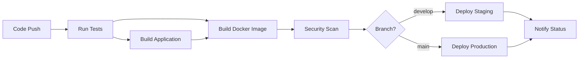

# Task API (Spring Boot + MongoDB)

Java 17 Spring Boot REST API storing tasks in MongoDB and executing safe shell commands.

## Run locally

- Prereqs: JDK 17+, Maven, MongoDB (or run via Docker)
- Start MongoDB quickly with Docker:

```bash
docker run -d --name mongodb -p 27017:27017 mongo:7
```

- Start the API:

```bash
mvn -q spring-boot:run -f pom.xml
```

- Default config uses `mongodb://localhost:27017/tasksdb`. Override with `MONGODB_URI`.

## API base

```
http://localhost:8080/api
```

## Endpoints

- GET `/tasks` (optional `id` query param)
- PUT `/tasks` (create/update Task)
- DELETE `/tasks/{id}`
- GET `/tasks/search?name=<substring>`
- PUT `/tasks/{id}/execute`

## Example payload

```json
{
  "id": "123",
  "name": "Print Hello",
  "owner": "John Smith",
  "command": "echo Hello World again!"
}
```

## cURL examples

- Create/Update a task

```bash
curl -X PUT http://localhost:8080/api/tasks \
  -H "Content-Type: application/json" \
  -d '{"id":"123","name":"Print Hello","owner":"John Smith","command":"echo Hello World again!"}'
```

- Get all tasks

```bash
curl http://localhost:8080/api/tasks
```

- Get task by id

```bash
curl "http://localhost:8080/api/tasks?id=123"
```

- Search by name substring

```bash
curl "http://localhost:8080/api/tasks/search?name=print"
```

- Execute task command by id

```bash
curl -X PUT http://localhost:8080/api/tasks/123/execute
```

- Delete task

```bash
curl -X DELETE http://localhost:8080/api/tasks/123
```

## Docker Support

### 🐳 Installing Docker (Required for Full Testing)

If Docker is not installed on your system:

```powershell
# Run the Docker installation helper
.\install-docker.ps1

# Or install manually from: https://docs.docker.com/desktop/install/windows-install/
```

**Quick Installation with Winget:**
```powershell
# Run as Administrator
winget install Docker.DockerDesktop
```

After installation, restart your computer and verify:
```powershell
docker --version
docker-compose --version
```

### Build and run with Docker Compose

```bash
# Build and start all services (API + MongoDB)
docker-compose up --build

# Run in background
docker-compose up -d --build

# Stop services
docker-compose down

# View logs
docker-compose logs -f task-api
```

### Build Docker image manually

```bash
# Build the image
docker build -t task-api:latest .

# Run with external MongoDB
docker run -p 8080:8080 -e MONGODB_URI=mongodb://host.docker.internal:27017/tasksdb task-api:latest
```

### 🧪 Testing Docker Setup

Once Docker is installed, test your setup:

```powershell
# Test Docker installation and build
.\test-docker.ps1

# Test specific components
.\test-docker.ps1 -TestType build    # Test Docker build only
.\test-docker.ps1 -TestType compose  # Test Docker Compose only
.\test-docker.ps1 -TestType app      # Test full application stack
```

The test script will:
- ✅ Verify Docker installation
- ✅ Build the Docker image
- ✅ Start MongoDB container
- ✅ Start application container
- ✅ Test API endpoints
- ✅ Test Docker Compose stack
- 🧹 Clean up test containers

## CI/CD Pipeline

This project includes a comprehensive GitHub Actions CI/CD pipeline that:

### **Continuous Integration (CI)**
- **Code Testing**: Runs unit tests with MongoDB test database
- **Code Build**: Compiles and packages the Spring Boot application using Maven
- **Docker Build**: Creates multi-platform Docker images (AMD64/ARM64)
- **Security Scanning**: Scans Docker images for vulnerabilities using Trivy
- **Test Reporting**: Generates and publishes test reports

### **Continuous Deployment (CD)**
- **Staging Deployment**: Auto-deploys `develop` branch to staging environment
- **Production Deployment**: Auto-deploys `main` branch to production environment
- **Container Registry**: Pushes images to GitHub Container Registry (ghcr.io)
- **Notifications**: Sends deployment status notifications

### **Pipeline Triggers**
- Push to `main` or `develop` branches
- Pull requests to `main` branch

### **Setup Instructions**

1. **Enable GitHub Actions**: Ensure Actions are enabled in your repository settings

2. **Configure Environments** (Optional):
   - Go to Settings → Environments
   - Create `staging` and `production` environments
   - Add protection rules and required reviewers

3. **Container Registry Permissions**:
   - The pipeline uses `GITHUB_TOKEN` (automatically available)
   - Images are pushed to `ghcr.io/your-username/your-repo`

4. **Customize Deployment**:
   - Edit `.github/workflows/ci-cd.yml`
   - Replace deployment commands in `deploy-staging` and `deploy-production` jobs
   - Add your specific deployment logic (kubectl, cloud CLI, etc.)

### **Pipeline Stages**



### **Available Docker Images**

After pipeline runs, images are available at:
- `ghcr.io/your-username/task_1_api:latest` (main branch)
- `ghcr.io/your-username/task_1_api:develop` (develop branch)
- `ghcr.io/your-username/task_1_api:main-<commit-sha>` (tagged builds)

## Notes

- Command validation allows a small safe allowlist: `echo`, `ls`/`dir`, `whoami`, `date`, `pwd` and rejects unsafe characters like `;`, `&&`, `|`, backticks, redirections, subshells, and dangerous commands.
- Execution uses your host shell (`cmd.exe /c` on Windows, `bash -lc` on Linux/macOS), with a 30s timeout, and captures stdout merged with stderr.
